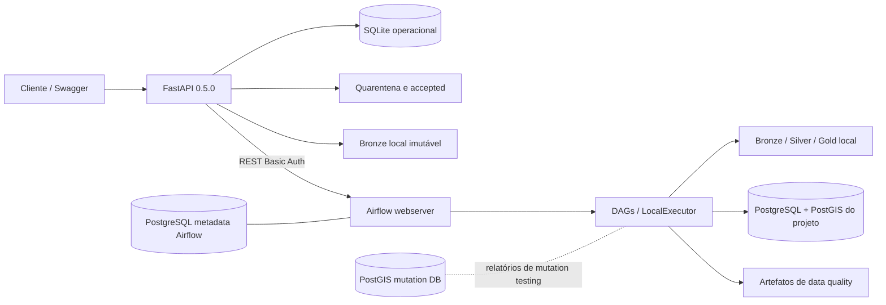
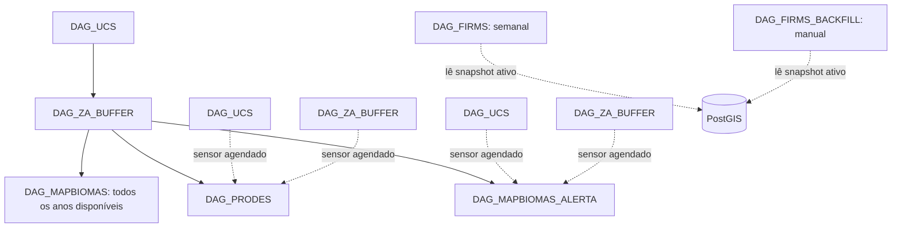

# Arquitetura real e evolução proposta

## Estado atual

**CONFIRMADO.** O sistema é composto por duas aplicações locais e três persistências lógicas:

O Docker Compose do pipeline usa Airflow 2.8.4 com `LocalExecutor`, scheduler, webserver e triggerer. `./data` e `./logs` são bind mounts. O banco principal contém o domínio geoespacial; o banco de metadados pertence ao Airflow. O mutation DB não recebe o schema cadastral por seu script de inicialização atual.

## Fluxo dirigido API → Airflow

1. A API recebe ZIP Shapefile, GeoJSON ou KML, mantém o original em quarentena e calcula SHA‑256.
2. Valida formato, ZIP, CRS, geometria, limites e regras do domínio.
3. Produz GeoJSON canônico EPSG:4674, relatório e manifesto.
4. A publicação copia um lote imutável para a Bronze e chama a API REST do Airflow.
5. `DAG_UCS` ou `DAG_ZA_BUFFER` resolve o manifesto, processa e grava o PostGIS.
6. UC dispara ZA/Buffer de Abrangência; após a barreira `validate_zone_readiness`, ZA/Buffer de Abrangência dispara e aguarda PRODES, MapBiomas Alerta e MapBiomas Uso/Cobertura.
7. O status da importação é reconciliado consultando o DAG run e o resultado do pipeline.

**CONFIRMADO:** FIRMS permanece fora do trigger cadastral automático mesmo após sua implementação. A aquisição semanal e o backfill são independentes; uma futura reassociação cadastral deverá reutilizar a Silver, sem nova chamada à fonte.

Execuções temáticas periódicas não esperam uma DAG cadastral com a mesma data lógica.
Elas usam o snapshot ativo já publicado. O encadeamento cadastral acima é uma execução
adicional, dirigida pelo manifesto da API, e não uma dependência temporal das agendas.

## Topologia das DAGs

Os services especializados implementam a regra de domínio. Os arquivos de DAG devem permanecer responsáveis apenas por schedule, dependências, retries, tasks e passagem de contexto.

## Medallion real

- Bronze: fontes e lotes imutáveis ou legados, particionados por domínio/data/importação.
- Silver: GPKG/raster normalizado e validado, CRS canônico e atributos técnicos.
- Gold: GeoJSON/CSV/raster e agregações adequadas a consumo.
- PostGIS: snapshot cadastral, histórico e relações temáticas consultáveis.
- Quality: `summary.json` e rejeições CSV/GeoJSON por run/stage/branch.

O cleanup Medallion atual apaga diretórios Silver e Gold com mais de 30 dias, semanalmente (segunda, 06:15 UTC), usando timestamp do nome ou `mtime`. Não possui dry-run ou configuração por ambiente.

## Riscos arquiteturais confirmados

1. O baseline cadastral foi consolidado em `init_db.sql` e validado em banco vazio; migrations antigas da API ainda devem ser reconciliadas antes do primeiro deploy para evitar duplicar mecanismos sem uso.
2. ZIP legado nos services usa `extractall` sem as proteções já presentes na API.
3. PRODES/MapBiomas Alerta usam EPSG:32722 para áreas, divergindo do EPSG:31982 acadêmico.
4. Branches ZA e Buffer de Abrangência paralelas podem competir; o trigger do banco preserva a invariante, mas uma execução pode falhar/repetir.
5. Credenciais default aparecem em exemplos/Compose; não há secret backend.
6. A API pública não implementa autenticação/autorização própria.
7. O armazenamento local não possui adapter S3 efetivo.
8. PRODES e MapBiomas Alerta ainda têm dívida de padronização geométrica/CRS registrada nos requisitos e testes.

## Evolução proposta

**INFERIDO, sujeito a aprovação:** manter o MVP local e introduzir interfaces mínimas somente nas bordas que de fato mudarão. FIRMS e MapBiomas já possuem services próprios. A migração futura a S3 preservará chaves relativas, manifestos, checksum e contratos Medallion; caminhos Windows não entram na lógica de domínio.
